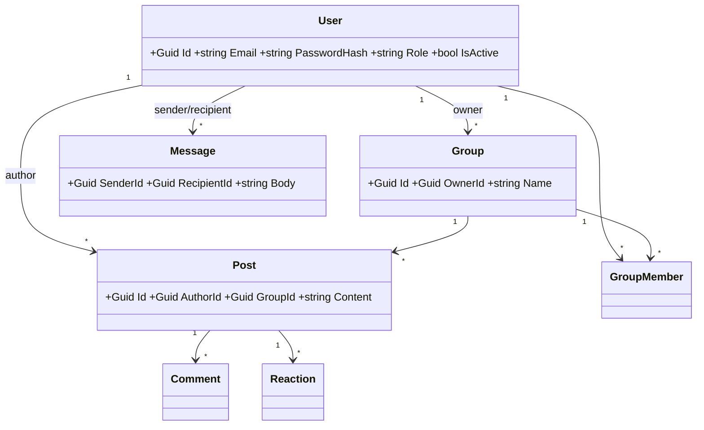

# Diagrama de clases

```mermaid
classDiagram
  User "1" --> "*" Post : author
  User "1" --> "*" Group : owner
  User "1" --> "*" GroupMember
  Group "1" --> "*" GroupMember
  Group "1" --> "*" Post
  Post "1" --> "*" Comment
  Post "1" --> "*" Reaction
  User "1" --> "*" Message : sender/recipient
  class User { +Guid Id +string Email +string PasswordHash +string Role +bool IsActive }
  class Post { +Guid Id +Guid AuthorId +Guid GroupId +string Content }
  class Group { +Guid Id +Guid OwnerId +string Name }
  class Message { +Guid SenderId +Guid RecipientId +string Body }
```
