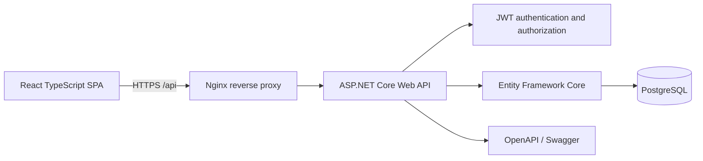

# Diagrama de componentes

```mermaid
flowchart LR
  Browser[React TypeScript SPA] -->|HTTPS /api| Proxy[Nginx reverse proxy]
  Proxy --> API[ASP.NET Core Web API]
  API --> Auth[JWT authentication and authorization]
  API --> EF[Entity Framework Core]
  EF --> PG[(PostgreSQL)]
  API --> OpenAPI[OpenAPI / Swagger]
```
