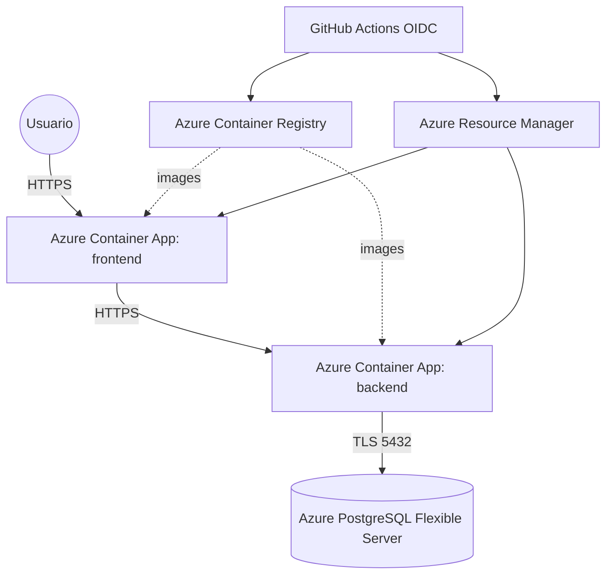

# Diagrama de despliegue

```mermaid
flowchart TB
  User((Usuario)) -->|HTTPS| Frontend[Azure Container App: frontend]
  Frontend -->|HTTPS| Backend[Azure Container App: backend]
  Backend -->|TLS 5432| Database[(Azure PostgreSQL Flexible Server)]
  ACR[Azure Container Registry] -. images .-> Frontend
  ACR -. images .-> Backend
  GitHub[GitHub Actions OIDC] --> ACR
  GitHub --> Azure[Azure Resource Manager]
  Azure --> Frontend
  Azure --> Backend
```
