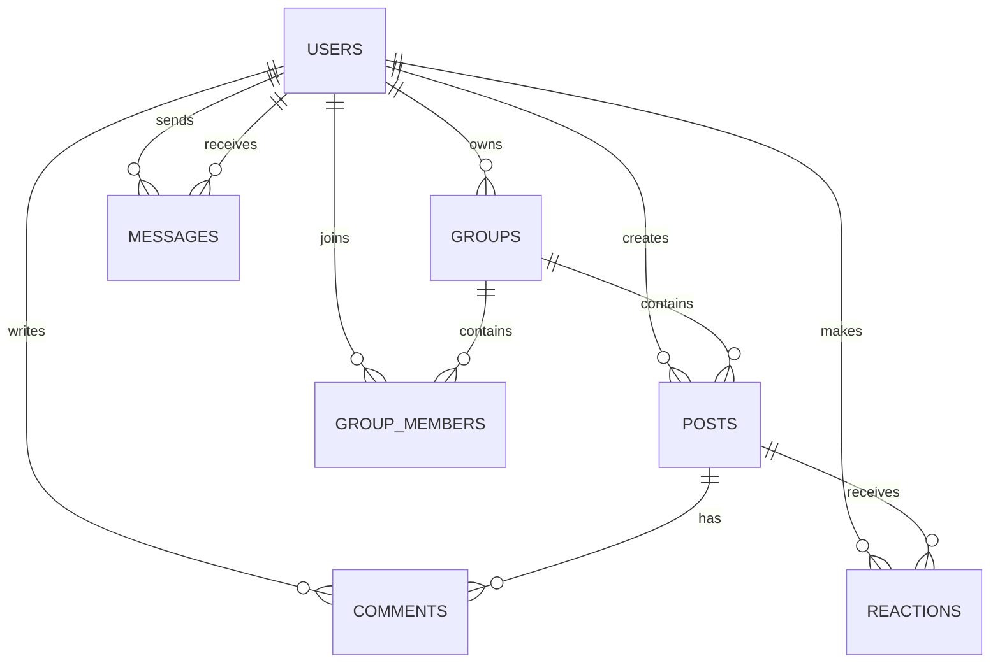

# Diagrama entidad–relación

```mermaid
erDiagram
  USERS ||--o{ POSTS : creates
  USERS ||--o{ COMMENTS : writes
  USERS ||--o{ REACTIONS : makes
  USERS ||--o{ GROUPS : owns
  USERS ||--o{ GROUP_MEMBERS : joins
  GROUPS ||--o{ GROUP_MEMBERS : contains
  GROUPS ||--o{ POSTS : contains
  POSTS ||--o{ COMMENTS : has
  POSTS ||--o{ REACTIONS : receives
  USERS ||--o{ MESSAGES : sends
  USERS ||--o{ MESSAGES : receives
```
